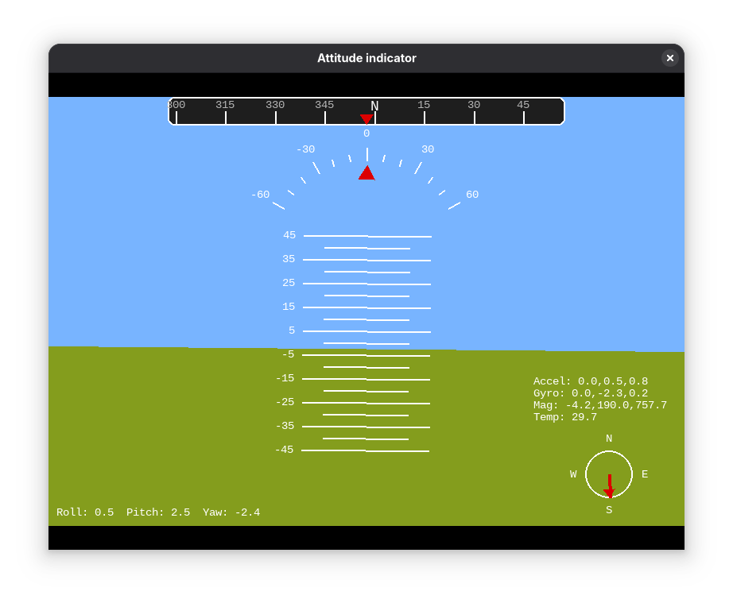

# ESP32 MPU-9250

ESP32 ile MPU-9250 sensör kalibrasyonu, füzyonu ve görselleştirilmesi.

## Çalıştırma

`run.sh` çalıştırılarak tüm işlevler kullanılabilir.

> [!NOTE]
> Komutları ya da programı başlatmadan önce ESP32'yi `EN` tuşuna basarak sıfırlayınız. Sıfırlamadan programı başlatırsanız ya da programı geç başlatırsanız düzgün çalışmayabilir.

```console
chmod +x run.sh
./run.sh
```

### Elle Çalıştırma

Eğer `run.sh` ile çalıştırmak istemiyorsanız ya da çalıştıramıyorsanız elle çalıştırmak için aşağıdaki komut satırı parametrelerini kullanabilirsiniz.

#### Kalibrasyon

Sensörlerin kalibrasyonu aşağıdaki parametreler ile ayrı ayrı yapılabilir. *Not: accel ve gyro parametreleri aynı anda ivmeölçeri ve jiroskobu kalibre etmektedir. Birini çalıştırmanız ikisini de kalibre edecektir.*

```console
python main.py --calibrate <option>
                           accel, gyro, magn
```

**İvmeölçer** ve **Jiroskop** kalibrasyonu için sensörü x ve y-eksenleri zemine paralel olacak biçimde düz ve hareketsiz tutun.

**Magnetometre** kalibrasyonu yapılırken sensörü şeklinde hareket ettirin.

#### Durum Göstergesi

```console
python ai.py
```


